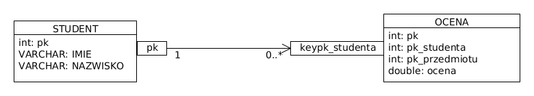
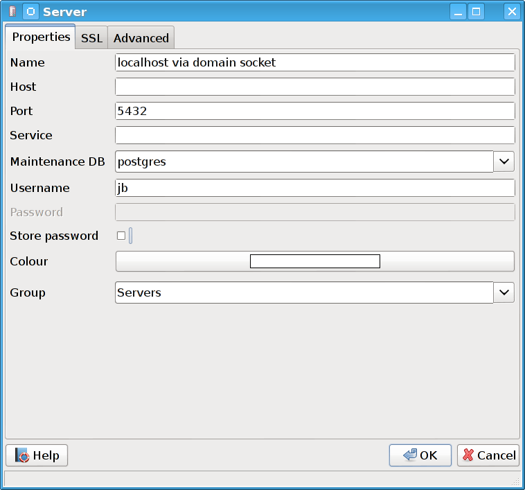
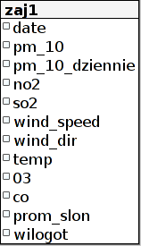

Zajęcia 1: Wykład (SQL cz. 1)
=============================

:date: 2015-10-01
:tags: zaj1, wykład, materiały
:category: materiały

.. note::

  Wykład do pobrania również w wersji PDF.

  .. raw:: html

     <a href="downloads/pdfs/wyk1.pdf">Wersja pdf tutaj</a>

.. contents:: Spis treści

Po co uczymy się o SQL
----------------------

SQL jest używany w większości webaplikacji (nawet tych największych), i mimo
rozlicznych wad relacyjnych baz danych, nie stworzono do tej pory lepszego
rozwiązania.

Podczas tworzenia webaplikacji zasadniczo rzadko pisze się czysty kod SQL,
jednak:

* W każdej (nietrywialnej) aplikacji musiałem napisać jakiś kod SQL.
* Zrozumienie podstaw SQL ułatwi np. rozumienie generowanego kodu SQL.

.. note::

  Głównym problemem z bazami SQL jest ich skalowalnośc, tj: **trudno** jest
  stworzyć system który ma rozmiar Twittera czy Facebooka i przechowuje dane
  w bazie danych SQL.

  Odpowiedzią na te problemy miały być bazy danych NoSQL, które zasadniczo
  lepiej się skalują, jednak najczęściej bazy NoSQL wykorzystywane są **dodatkowo**
  jako wsparcie baz relacyjnych.

Rodzaje baz danych
------------------

Relacyjne (z ang. relational)

    podstawą są tabele, czasem nazywane relacjami oraz więzi
    (inaczej ograniczenia) między nimi.

Klucz-wartość (z ang. key-value)

    pozwalają przypisywać do kluczy (będących dowolnym ciągiem znaków) wartości.

    Przykładem takiej bazy danych może być system plików:
    przypisuje on ściećkom plików (czyli kluczom), wartość czyli zawartość
    plików.

Dokumentowe

    służą do przechowywania dokumentów, mają dużo
    słabsze ograniczenia na spójność danych, ponieważ dokumenty
    mogą się zmieniać.

Kolumnowe

    W bazach typowych relacyjnych na dysku, dane o jednym
    rzędzie w tabeli przechowywane są razem. W bazach kolumnowych
    razem przechowujemy dane o kolumnie.

Grafowe (z ang. graph)

    przechowują grafy

Bazy danych, które nie są relacyjne często określa się terminem
NoSQL.

Zalety systemów relacyjnych
^^^^^^^^^^^^^^^^^^^^^^^^^^^

.. note::

    Proszę nie traktować rzeczy podanych w zaletach i wadach systemów
    relacyjnych, jako wyroczni. Od tych ogólnych zasad są wyjątki!

* Gwarantują spójność danych.
* Gwarantują zachowanie tranzakcji w systemie.
* Na etapie konstrukcji bazy danych nie musimy wiedzieć jakie
  rodzaje zapytań będą wykonywane na bazie danych (nie jest to
  prawda dla wszystkich baz ``NoSQL``).
* Na etapie konstruowania zapytania nie musimy myśleć o tym,
  jak zostanie wykonane (jest to prawda również dla niektórych systemów NoSQL)
* Model relacyjny ma solidne podstawy i aksjomatyzację matematyczną, co
  znacznie ułatwia opisywanie zachowania baz danych, optymalizację schematu
  itp.

Wady systemów relacyjnych
^^^^^^^^^^^^^^^^^^^^^^^^^

* Systemy ``NoSQL`` zasadniczo lepiej się skalują, tj. łatwiej jest wykonać
  system składający się z kilkuset fizycznych serwerów ``NoSQL`` działających razem,
  niż system kilkudziesięciu serwerów relacyjnych działających razem.
* Specjalistyczne (czyli takie, które są w stanie przechowywać tylko pewien
  rodzaj danych: na przykład grafowe, dokumentowe, klucz-wartość) systemy ``NoSQL``,
  są w stanie wydajniej i wygodniej przechowywać ten rodzaj danych, niż systemy
  relacyjne.

Przykład schematu relacyjnego
-----------------------------

    Przykład schematu relacyjnego

Ważne cechy schematu relacyjnego:

* Dane są przechowywane tylko w wierszach tabel.
* Tabele mają kolumny o ustalonym typie.
* Na poszczególne wiersze nałożone mogą być pewne ograniczenia.
* System musi być przygotowany do repreezentowania "braku informacji"

Opcjonalnie możecie się zapoznać z tym dokumentem: http://en.wikipedia.org/w/index.php?title=Codd%27s_12_rules&oldid=574873395.

Informacje o strukturze danych w bazie nazywamy
schematem (z ang. database schema).

Wartość NULL
^^^^^^^^^^^^

Wartość ``NULL`` reprezentuje informację o tym, że dana wartość jest niedostępna.
Jeśli w kolumnie ``ocena`` zawarta jest wartość ``NULL`` oznacza to, że system nie posiada
informacji o danej ocenie.

Wprowadzenie wartości ``NULL`` jest ważne ponieważ pozwala ona jasno i jednoznacznie
powiedzieć: tej informacji nie mamy oraz żadna poprawna wartość w żadnej kolumnie
nigdy nie będzie równa ``NULL``.

Ograniczenia w bazie danych
^^^^^^^^^^^^^^^^^^^^^^^^^^^

Systemy relacyjne pozwalają nakładać na schemat pewne ograniczenia albo inaczej
więzy (*z ang.* constraints) przykłady ograniczeń zawartych w przykładzie:

klucz główny *z ang.* primary key

    Kolumna ``id`` tabeli student jest unikalna (dwóm wierszom nie może być
    przypisana taka sama wartość w tej kolumnie) oraz nie może przyjmować
    wartości pustej. Klucz główny jednoznacznie identyfikuje dany wiersz w tabeli.

nie pustość *z ang.* non null

    Kolumny ``imie`` oraz ``nazwisko`` nie mogą zawierać wartości pustej
    (czuli ``NULL``)

sprawdzenie *z ang.* check constraint

    Check constraint pozwala wymusić, by dany wiersz spełniał zadane wyrażenie
    logiczne. W kolumnie ocena są wartości od 2 do 5.

klucz obcy *z ang.* foreign key

    Klucz onbcy pozwala na definiowanie zależności między tabelami mówimy, że
    ocena A jest oceną studenta B jeśli w kolumnie 'pk_studenta' tabeli 'ocena' jest
    identyfikator studenta A.

    Klucz obcy pełni takie funkcje:

    * Informuje użytkownika o występowaniu takiej relacji.
    * Gwarantuje, że wiersz do którego odnosi się klucz obcy istnieje w drugiej
      tabeli. Tj. jeśli w tabeli ``ocena`` w kolumnie ``pk_studenta`` będzie
      wartość X, to istnieje student o ``id`` równym X.

Spójność danych
^^^^^^^^^^^^^^^

Wymuszanie podanych w poprzednim paragrafie ograniczeń mogłoby być
nietrywialne, jednak to silnik bazy danych wymusza je za nas.

To jest pierwsza ważna cecha baz danych: programista definiuje
schemat a baza danych go wymusza.

Baza danych postgresql
----------------------
Będziemy korzystać z bazy danych PostgreSQL. Baza ta jest najbardziej
zaawansowaną opensource bazą danych na rynku oraz jest dość zgodna
ze standardem SQL.

Narzędzia administracyjne bazy danych
^^^^^^^^^^^^^^^^^^^^^^^^^^^^^^^^^^^^^

Polecenie konsolowe ``psql``
****************************

Polecenie to pozwala na interakcje z bazą danych za pomocą
konsoli. Ma ono wszystkie możliwości klientów
graficznych.

Podstawowa składania polecenia to:

.. code-block:: bash

    psql [baza danych]

W tym trybie psql przyjmie polecenia ze standardowego wejścia
w trybie interaktywnym.

Możemy też zmusić go do przetworzenia pliku wejściowego:

.. code-block:: bash

    psql -f [plik] [baza danych]

Pełny opis polecenia: http://www.postgresql.org/docs/9.2/static/app-psql.html.

Interfejs graficzny PGADMIN
***************************

Bardzo potężne narzędzie, jest natomiast dość proste w obsłudze.
Jedynym problemem, jaki mogą Państwo mieć jest to, by w łączeniu
do lokalnego komputera pole host zostawić puste.
Słowem  konfiguracja serwera powinna być taka:

    Poprawna konfiguracja postgresql

Wybieranie danych
-----------------

Do pobierania danych z bazy dancyh służy polecenie ``SELECT``

.. note::

    Proszę nie myśleć o poleceniu ``SELECT``,
    jako o metodzie na wybieranie danych, ale raczej jako o metodzie
    opisywania danych, które chcemy pobrać.

    Opis ten jest oderwany od tego w jaki sposób to zapytanie należy wykonać ---
    o to martwi się serwer baz danych.

Składnia polecenia SELECT
^^^^^^^^^^^^^^^^^^^^^^^^^

W najprostszej wersji polecenie to ma taką postać:

.. code-block:: sql

    SELECT * FROM tabela;

`Wynik zapytania <downloads/wyklad1/data/selectstar.html>`__

Znaczy ono: zbiór danych, który chce pobrać zawiera dane
ze wszystkich kolumn i wszystkich wierszy tabeli.

Na pierwszych zajęciach będziemy pracowali na takiej tabeli:

    Schemat do pierwszych zajęć

Tabela ta zawiera parametry pogodowe i poziomy zanieczyszczeń
stacji Warszawa Ursynów.

Ważne informacje o schemacie:

* Kolumna ``date`` zawiera chwilę zebrania pomiaru
* Kolumna ``pm_10`` zawiera poziom pyłu zawieszonego :math:`PM_{10}`.
* kolumna ``wind_speed`` zawiera kierunek wiatru (w stopniach!)

Klauzula WHERE
^^^^^^^^^^^^^^

Do ograniczania zakresu wybieranych rzędów danych służy klauzula ``WHERE``,
Powiedzmy, że chcemy wybrać dane ze stycznia 2012 roku.

.. code-block:: sql

    SELECT * FROM zaj1 WHERE date
      BETWEEN '2012-01-01' AND '2012-01-31';

`Wyniki zapytania <downloads/wyklad1/data/selectwhere.html>`__

.. note::

      Poza klauzulą where mamy tutaj kilka cech języka postgresql. Za pomocą
      znaków ``'`` oznaczamy stałe określające ciągi znaków.

      .. note::
        Podałem datę jako ciąg znaków, co nie oznacza, że w ten sposób daty są
        przechowywane w bazie danych (jest to wydajniejszy format), po prostu
        postgres umie rzutować ciągi znaków w dobrym formacie na datę.

Klauzula ``WHERE`` przyjmuje dowolne wyrażenie logiczne, w tym zapytaniu wybieramy
dane ze stycznia w dniach, w których jednocześnie przekroczono poziomy
:math:`PM_{10}` oraz :math:`NO_2`:

.. code-block:: sql

    SELECT * FROM zaj1
        WHERE date BETWEEN '2012-01-01'
            AND '2012-01-31' AND ( pm_10 > 50 or no_2 > 200);

`Wyniki zapytania <downloads/wyklad1/data/selectwhere_expre.html>`__

Dodatkowe informacje:

* `Operatory logiczne w PostgreSQL <https://www.google.pl/?q=postgresql%209.2%20logical%20operators#q=postgresql+9.2+logical+operators>`_
* `Operatory porównania w PostgresQL <https://www.google.pl/?q=postgresql%209.2%20comparision%20operators#q=postgresql+9.2+comparision+operators>`_

Wybieranie kolumn
^^^^^^^^^^^^^^^^^

Możemy określać, jakie kolumny zbioru wynikowego nas interesują,
na przykład, żeby wybrać datę i kierunek wiatru możemy napisać,
w takim wypadku po słowie ``SELECT`` pojawia się lista wyrażeń, które
określają poszczególne kolumny wybranego zbioru danych:

.. code-block:: sql

  SELECT date, wind_dir FROM zaj1;

`Wynik zapytania <downloads/wyklad1/data/selectcolumn.html>`__

Nie musimy wybierać kolumn tabeli, możemy wybrać dowolne wyrażenia, które
operują (lub nie) na danych z poszczególnych kolumn.

.. code-block:: sql

    SELECT date, radians(wind_dir) FROM zaj1;

`Wynik zapytania <downloads/wyklad1/data/selectradians.html>`__

Wyrażenia wybierane mogą być całkiem dowolne:

.. code-block:: sql

    SELECT 6/2*(1+2) FROM zaj1;

`Wynik zapytania <downloads/wyklad1/data/select-zagadka.html>`__

Możemy też wykonywać zapytania wybierające dane z wielu kolumn:

.. code-block:: sql

     SELECT no_2 + pm_10 AS nonsens FROM zaj1;

`Wynik zapytania <downloads/wyklad1/data/select-nonsense.html>`__

W tym zapytaniu użyto również klauzuli ``AS``, która pozwala
wyrażeniu (lub kolumnie) nadać określoną nazwę w zbiorze wynikowym.

Dodatkowe informacje:

* `Matematyczne funkcje w postgresql <https://www.google.pl/?q=postgresql%209.2%20mathematical%20functions#q=postgresql+9.2+mathematical+functions>`_

Sortowanie danych
^^^^^^^^^^^^^^^^^

Domyślnie dane dane wybierane z zestawu danych, nie są sortowane,
albo inaczej: *są wybierane w takiej kolejności w jakiej serwerowi wygodnie*
Przy prostych zapytaniach jest to kolejność, w których dane leżą na dysku, a
ponieważ do tej tabeli dane były dodawane w kolejności dat, w takiej kolejności
pojawiły się na dysku i tak są wybierane.

By wymusić sortowanie wyników względem jakiejś kolumny używamy klauzuli
order by:

.. code-block:: sql

    SELECT * FROM zaj1 ORDER BY date desc;

`Wyniki zapytania <downloads/wyklad1/data/selectorder.html>`__, proszę porównać z
`tym samym zapytaniem bez klauzuli order by <downloads/wyklad1/data/selectstar.html>`__

Słowo ``desc`` (skrót ot *descending*) oznacza kierunek sortowania od wartości największej do najmniejszej.
Przy uznaniu co oznacza wartość *największa* i *najmniejsza* można kierować
się intuicją, jedyny problem jest z `sortowaniem i porównywaniem ciągów znaków
<https://www.google.com/search?q=postgresql+string+collation>`_.  By posortować
dane od wartości najmniejszej do największej należałoby użyć ``asc`` (*ascending*).
Domyślnie (bez podania ``desc`` i ``asc``) dane są sortowane od najmniejszej do
największej.

Proszę poprzednie zapytanie z:

.. code-block:: sql

    SELECT date, wind_dir, pm_10 FROM zaj1
      ORDER by wind_dir;

`Wynik zapytania <downloads/wyklad1/data/selectordermany-compare.html>`__

Możemy też sortować względem wyrażenia:

.. code-block:: sql

    SELECT date, sin(radians(wind_dir)) FROM zaj1
      ORDER by sin(radians(wind_dir));

`Wynik zapytania <downloads/wyklad1/data/selectorderexpression.html>`__

Funkcje agregujące
------------------

Ilość analiz jakie możemy zrobić za pomocą operacji na pojedyńczych wierszach
jest ograniczona.

Powiedzmy że chcemy poznać średni poziom zanieczyczeń dla całego zestawu
danych:

.. code-block:: sql

    SELECT AVG(pm_10), AVG(NO_2) FROM zaj1;

`Wynik zapytania <downloads/wyklad1/data/selectavg.html>`__.

Proszę zauważyć że klauzula ``AVG`` oraz inne funkcje agregujące
(*z. ang* aggregate functions) całkiem zmienia nam wybrany zestaw danych!
W tym wypadku powoduje, że w zestawie wyikowym mamy jeden wiersz.

By wybrać średni poziom z jakiegoś okresu czasu należałoby
dodać klauzulę ``where``

.. code-block:: sql

    SELECT AVG(pm_10) FROM zaj1
      WHERE date BETWEEN '2012-01-01' AND '2012-01-31';

`Wynik zapytania <downloads/wyklad1/data/selectavg-where.html>`__

Przykłady funkcji agregujących:

``COUNT``

    Zwraca ilość wierszy w zestawie danych

``STDDEV``

    Zwraca odchylenie standardowe

``AVG``

    Zwraca średnią

``MAX``

    Zwraca największą wartość z zestawu danych

`Więcej funkcji agregujących
<https://www.google.pl/?q=postgresql%209.2%20aggregate%20functions>`_

Klauzula ``GROUP BY``
^^^^^^^^^^^^^^^^^^^^^

Wybranie średniej całego zestawu danych też ma ograniczoną
przydatność, by wykonać funkcje agregujące na pewnych podzbiorach
danych należy użyć klauzuli ``GROUP BY``.

Klauzula ta przyjmuje kolumnę bądź wyrażenie oraz powoduje podział
zbioru danych na podgrupy, dla których wyrażenie w ``group by`` przyjmuje
taką samą wartśsć oraz wyznaczenie funkcji agregujących dla tych
podgrup oddzielnie.

.. code-block:: sql

    SELECT AVG(wind_speed), pm_10 > 50 as przekroczenie
    FROM zaj1 GROUP BY pm_10 > 50;

`Wynik zapytania <downloads/wyklad1/data/selectavg-group-by.html>`__

W tym wypadk dzielimy zbiór danych na dwa podzbiory: w pierwszym
nastąpiło przekroczenie dopuszczalnego dziennego poziomu pyłu zawieszonego
:math:`PM_{10}`, w drugim przekroczenia nie było.

.. code-block:: sql

    SELECT AVG(wind_speed), wind_dir, COUNT(*)
    FROM zaj1 GROUP BY wind_dir ORDER BY wind_dir;

`Wynik zapytania <downloads/wyklad1/data/selectavg-group-by-2.html>`__

Teraz grup mamy 360 (tyle ile jest różnych wartości kierunku wiatru).

Gdy w wyrażeniu pojawia się klauzula ``GROUP BY`` znacznie ogranicza
się to, co możemy podać po klauzuli ``SELECT``, mianowicie możemy podać:

1. Wyrażenie zawierające wynik działania funkcji agregujących na
   *dowolnych* kolumnach
2. Wyrażenie zawierające wyrażenie przekopiowane z klauli ``GROUP BY``

Przykładowo w zapytaniu z klauzulą ``GROUP BY sin(radians(wind_speed))``
może pojawić się:

* Wyrażenie ``AVG(pm_10)`` (zasada 1)
* Wyrażenie ``sin(radians(wind_speed))`` (zasada 2)

Nie może natomiast pojawić się:

* Wyrażenie ``pm_10``
* Wyrażenie ``wind_speed`` (mimo że kolumna ``wind_speed`` była użyta w
  grupowaniu)

Takie ograniczenie ma bardzo proste uzasadnienie: po zgrupowaniu względem
jakiegoś wyrażenia każdemu wierszowi tworzonego zbioru wynikowego
przypisane jest wiele wierszy z tabeli (wszystkie, dla których wyrażenie ``GROUP BY``
przyjmuje jedną wartość), a baza danych 'nie bardzo wie', którą z tych wartości
wybrać. My możemy: albo dać bazie danych przepis o tym, jak z tego zbioru danych
stworzyć jedną wartość do wyświetlenia (przepisem tym jest funkcja agregująca),
albo musimy wybrać wyrażenie z klauzuli ``GROUP BY``, ponieważ dla każdego
wiersza w zbiorze danych z definicji wyrażenie to musi dać tą samą wartość.

Proszę zastanowić się dlaczego takie zapytanie jest poprawne:

.. code-block:: sql

    SELECT AVG(pm_10), AVG(NO_2), sin(radians(wind_speed))
      FROM zaj1 GROUP BY wind_speed;

`Wynik zapytania: <downloads/wyklad1/data/select-group-by-ciekawostka-1.html>`__

A takie nie:

.. code-block:: sql

    SELECT AVG(pm_10), AVG(NO_2), wind_speed
      FROM zaj1
      GROUP BY sin(radians(wind_speed));

Dodatnowe przykłady:
^^^^^^^^^^^^^^^^^^^^

Powiedzmy, że chcemy wyznaczyć dzienne średnie poziomy pyłu zawieszonego
:math:`PM_{10}`, by tego użyć musimy użyć funkcji ``date_trunc``, powoduje ona
obcięcie wartości przechowującej czas do wyznaczonej dokładności.

Przykładowo nastpujące dwa zapytania zwracają ``true``:

.. code-block:: sql

    SELECT date_trunc('day', '2012-01-07 11:11'::date) = '2012-01-07';
    SELECT date_trunc('month', '2012-01-07 11:11'::date) = '2012-01-01';

Klauzula ``HAVING``
^^^^^^^^^^^^^^^^^^^

Klauzula ta działa jak klauzula where, ale pozwala filtrować
względem agregowanych wartości, na przykład by wybrać dni,
dla których poziom ``PM_10`` jest większy niż norma
należy wykonać zapytanie:

.. code-block:: sql

    SELECT AVG(pm_10), date_trunc('day', date)
      FROM zaj1
      GROUP BY date_trunc('day', date)
      HAVING AVG(pm_10) > 50 ORDER BY date_trunc('day', date);

`Wynik zapytania <downloads/wyklad1/data/selectavg-group-by-having.html>`__

Wyrażenie having, pozwala filtrować zbiór danych pod względem wyrażeń
zawierających funkcje agregujące.

Proszę zastanowić się czym różni się klauzula ``WHERE`` od klauzuli ``HAVING``.

Rzeczy do zapamiętania
----------------------

Najważniejszą rzeczą, którą powinniście wynieść z zajęć jest praktyczna
umiejętność wykonywania prostych zapytań SQL.

