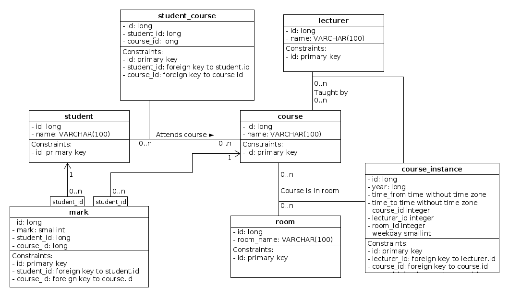

Zajęcia 2: Zadania
==================

:date: 2015-10-12
:tags: zaj2, zadania
:category: zadania

.. warning::

  Informuję że do oceny z zajęć będzie brane 6 najlepiej wykonanych zadań z
  zakresu ze zbioru wykonanych zadań o numerach 1, 2, 4, 5, 6, 7, 8
  (jedno z zadań możecie sobie "odpuścić").

  Zachęcam do obejrzenia Waszych prac w trakcie zajęc, lub konsultacji.

.. note::

  Zajęcia do pobrania również w wersji PDF.

  .. raw:: html

     <a href="downloads/pdfs/zaj2.pdf">Wersja pdf tutaj</a>

Opis schematu
-------------

W schemacie mamy takie tabele:

* ``student`` (reprezentuje studentów)
* ``mark`` (reprezentuje ocene)
* ``course``  (reprezentuje kurs akademicki)
* ``lecturer`` (reprezentuje nauczyciela)
* ``room`` (reprezentuje salę zajęciową)

Mamy takie relacje:

* studenta i ocenę łączy relacja 1 do wielu.
* studenta i kurs łączy relacja wiele do wielu
* kurs, pokój i prowadzącego łączy relacja wiele do wielu, poprzez tabelkę
  ``course_instance``, która reprezentuje zajęcia w określonej godzinie
  z określonego przedmiotu.

Tabelka ``course_instance`` określa cykliczne zajęcia określając następujące
parametry zajęć:

* Rok w którym odbywają się zajęcia
* Godzine rozpoczęcia i zakończenia zajęć 
* Dzień tygodnia zajęć

.. note::

  Ten model nie modeluje wszystkich detali działania uczelni wyższej, miał on
  być możliwie prosty

  Schamat bazy danych

Plik ze `schematem do pobrania <static/zaj2/zaj2-schema.sql>`_.

Zadanie 1a
----------

Wybrać zbiór danych zawierający dzień tygodnia, godzinę rozpoczęcia i
godzinę zakończenia zajęć z przedmiotu: "Projektowanie Webaplikacji 8",
to wszystko dla roku 2015.

W zapytaniu nie wolno odwoływać się do tabelki ``course`` (możecie
wcześniej sprawdzić jej zwartość).

Zadanie 1b
----------

Wybrać zbiór danych zawierający dzień tygodnia, godzinę rozpoczęcia i
godzinę zakończenia zajęć z przedmiotu: "Projektowanie Webaplikacji 8".

W zapytaniu nie może pojawić się literał stałoprzecinkowy, tj. zabronione
jest użycie wyrażeń jak: 1, 2, 3 ...

Zadanie 2
---------

Wygenerować plan zajęć dla roku 2015, tj. zestaw zawierający:

Dzień tygodnia, godzinę rozpoczęcia zajęć, godzinę rozpoczęcia zajęć, numer sali, nazwę przedmiotu, Imie i Nazwisko prowadzącego.

Posortowany po dniu tygodnia, godzinie rozpoczęcia zajęć oraz numerze sali.

Zadanie 3
---------

Wygenerować raport zawierający informacje kto prowadzi jakie zajęcia,
zestaw danych zawiera; imię i nazwisko prowadzącego, oraz nazwę kursu.

Wyniki są posortowane po nazwie kursu oraz nazwie prowadzącego.

Zadanie 4
---------

Wybrać zestaw danych zawierających średnie oceny studentów,
wraz z nazwą przemdiotu, jeśli jakiś student nie otrzymał oceny z przemdiotu
na który jest zapisany należy zwrócić wartość NULL.

Zestaw danych zawiera:

* Id studenta
* Imie i nazwisko studenta
* Id kursu
* Nazwę kursu
* Średnią ocenę 

Wynik jest posortowany po:

* Imieniu i nazwisku studenta oraz nazwie kursu.

Zadanie 5
---------

Znajdź ``course_instance`` w których występują kolizję, kolizja występuje jeśli
dwa ``course_instance`` są:

* w tej samej sali
* tego samego dnia
* godziny się zazembiają, tj:

  * początek ``course_instance`` a jest przed końcem ``course_instance`` b
  * początek b jest przed końcem a

Zadanie 6
---------

Wygenerować raport obciążeń akademickich dla nauczycieli za rok 2014,
rapot ten zawiera:

* Imię i nazwisko Nauczyciela
* Nazwę przedmiotu
* Ilość godzin zajęć z tego przedmiotu którą prowadzący prowadził
  Ilość ta jest wyliczana jako: 15*(długość zajęć prowadzonych w ramach
  wszystkich Course Instance do danego kursu).

.. note::

  By wyliczyć długość danego ``course_instance`` można posłużyć się:

  ``EXTRACT(hour from SUM(ci.time_to - ci.time_from))`` gdzie ``ci`` to
  wiersz ``date_instance``.

Zadanie 7
---------

Wygenerować raport obciążeń akademickich dla nauczycieli za rok 2014,

rapot ten zawiera

* Imię i nazwisko Nauczyciela
* Ilość godzin zajęć z tego przedmiotu którą prowadzący prowadził
  (**ze wszystkich przedmiotów**)

Jeśli dana osoba nie prowadziła zajęć, w drugiej kolumnie
powinna pojawić się wartość NULL

Zadanie 8
---------

Dla każdego studenta wygenerować raport zawierający nazwiska, prowadzących
wszystkich przedmiotów na które uczęszcza student.

Raport zawiera:

* Imie i nazwisko studenta
* Imie i Nazwisko nauczyciela
* Datę i godzinę zajęć.

Zadanie 9
---------

Narysować schemat tabeli w systemie blogowym, blog posty mają treść,
autora, datę dodania, kategorię, tagi i komentarze.

W ``pgadmin3`` stworzyć w nowej bazie danych, schemat reprezentujący Wasz pomysł.

.. note::

  Proszę pilnować by dane były w tej bazie znormalizowane (celowo nie podałem
  definicji "normalizacji bazy danych"), intuicyjnie można powiedzieć że
  baza danych jest znormalizowana jeśli: "jedna informacja jest tylko
  w jednym miejscu, oraz każda kolumna w każdej tabeli przechowuje
  dane, której nie da się bardziej podzielic".

  Przykładowo: pole ``adres`` nie jest znormalizowane, by je znormalizować
  należałoby je rozbić na następujące pola: ``Ulica``, ``nr. domu``,
  ``kod pocztowy`` (itp.)

Challenge 1
-----------

Jak Zadanie 7, ale jeśli dana osoba nie prowadziła zajęć, w drugiej kolumnie
powinna pojawić się wartość 0 (nie NULL jak w zadaniu 7).

